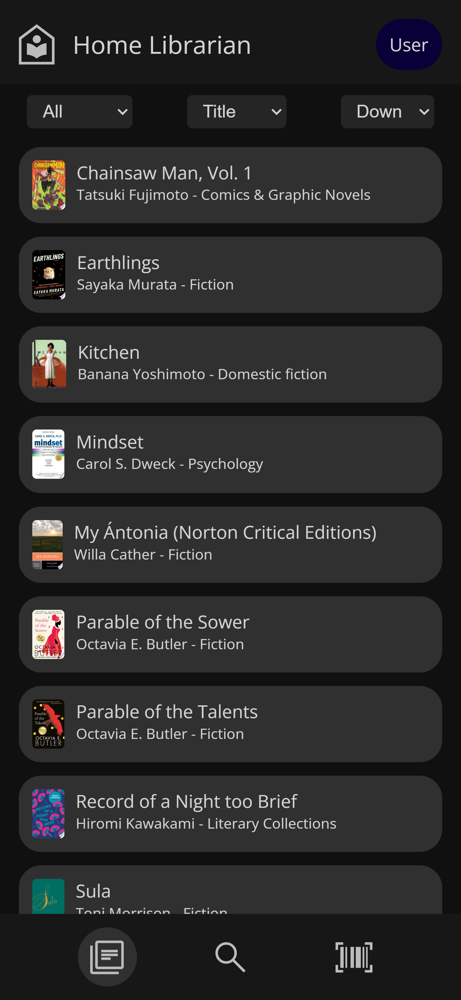
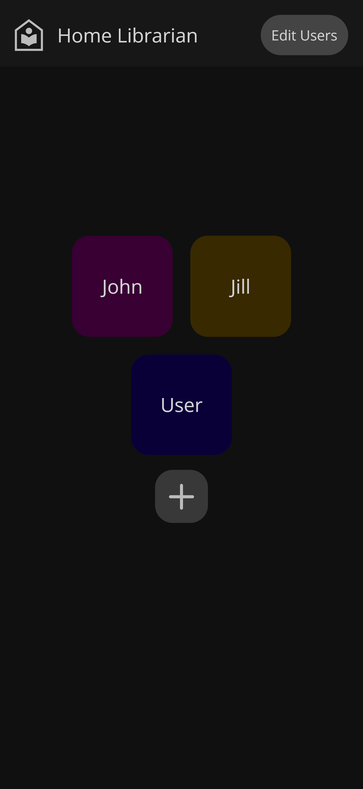
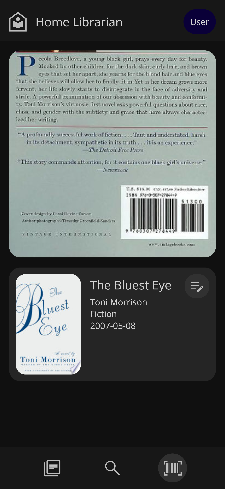
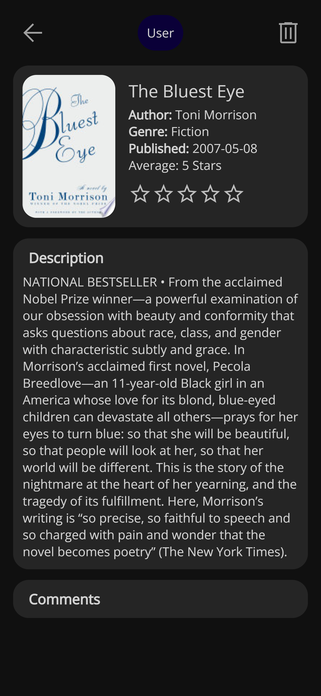

# Rusty Librarian
Does calling it this violate the new Rust trademark rules? Beats me. I speak Rust (poorly) not legalese.
## Overview
Ever wanted a home catalogue of your physical books? I did, so I made this.

It uses the Google Books API as a data source, an Actix Web server connected to MongoDB, and a vanilla JS front end.

This server runs on port 8100 by default and requires SSL (required for camera scanning use). The barcode scanning defaults to the built-in browser API feature (Android only for the foreseeable future), with a polyfill that should work for iOS, Desktop, Zune, Samsung Smart Fridge, or whatever.

| Browse Your Catalogue       | Add Users                     |
| :-------------------------- | :---------------------------- |
|  |  |

| Scan Books                  | Rate (Marks as Read)          |
| :------------------------   | :--------------------------   |
|    |    |

## Current Work
There is a path to "feature complete", and I definitely have not reached the end of it.

The TODOs:
- [x] Rating system
- [ ] Commenting frontend
- [ ] Search feature
- [ ] Personal notes feature
- [ ] User DB cleanup
- [ ] Better desktop browser UI
- [ ] In-app field editing to override the Google data
- [ ] Fallback searching to fix mismatched ISBNs

## Building / Running (Linux)
### Docker
- Don't forget to install `libssl-dev` (Ubuntu)
- `make build`
- Extract the tarball where you would like to deploy
- At the root of the extraction:
  - Run `make certs` to create the self-signed certs - it's a personal project  ¯\\\_(ツ)_/¯
  - `make run`

### Local
 - Add "datastore" as an alias for localhost in your hosts file
 - Bring up only the datastore
   - `docker compose up -d datastore`
   - Alternatively, install mongodb locally if you're docker averse and set it up as you would
 - (Optional) Install cargo watch
 - `cargo watch -x run` (or `cargo run`)

### Pure Windows
All of the above should work as expected provided you have openssl and make (can be installed with Chocolatey)